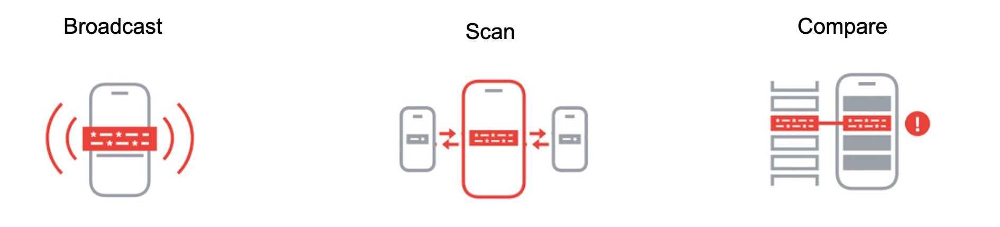
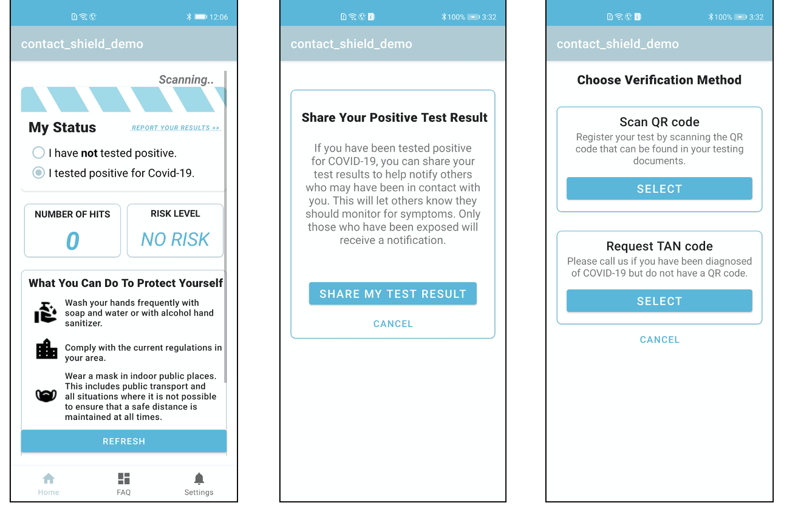
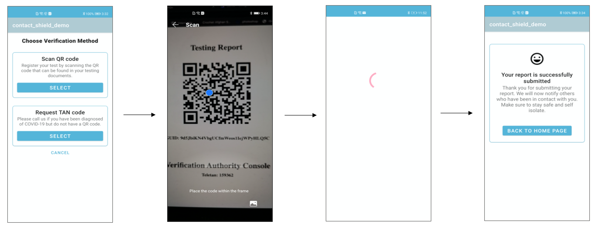
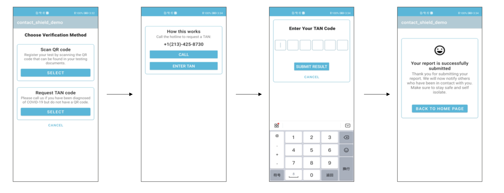
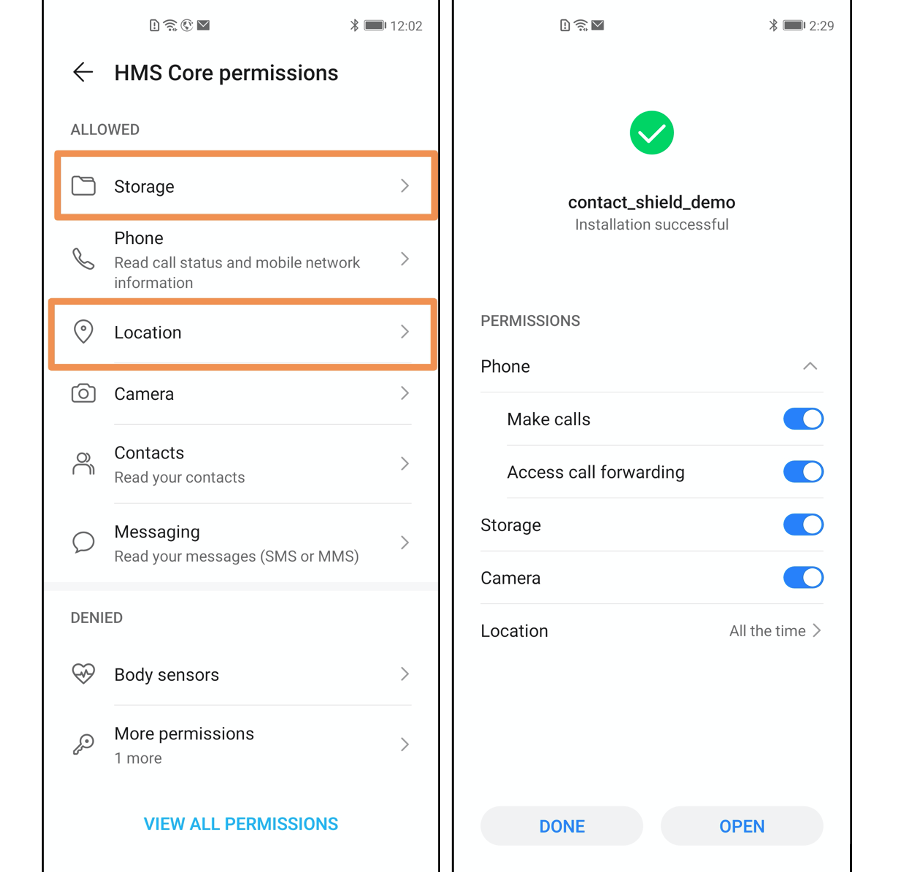
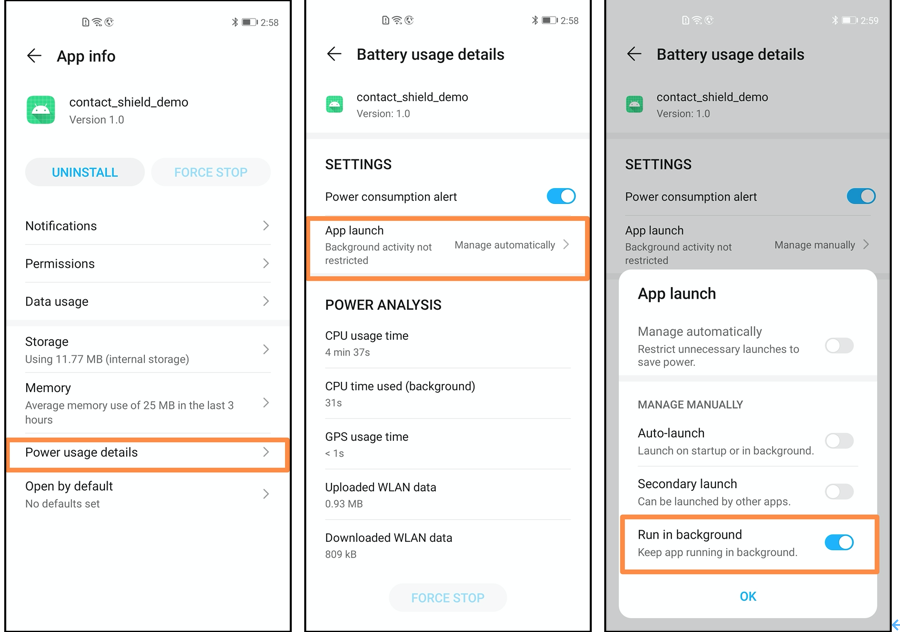

# Contact Shield Demo Testing Guide

**Thanks for participating this test!**

**For any question or error, please shot an email to zxu@futurewei.com.**

### Background:

This contact shield demo application is designed to better protects users during the pandemic. This app is based on Contact Shield API newly released by HMS, and it will alert users if they are at risk of getting COVID-19.

### How it works:

- All devices keep exchanging annoymous identifiers using Bluetooth
- For patients, he needs to upload his annoymous identifiers to the server everyday for everyone to download
- For all participants, he can download patient identifiers from server and compare identifiers the app has collected to get their latest exposure information

### What we test:

We are going to collect some statistical data during the test. This data can help us better understand how contact shield API work under multi-person scenarios.

### How we test:

There will be no real patients in our test. Thus, we need to designate someone to be patients. All designated patients will need to 'upload their annoymous identifiers' to the server EVERYDAY. At the same time, all participants should refresh to 'check their status' at least once a day. This app will make a record when you upload your identifiers or click refresh, and sychronize data with the server. Apart from these two auto collected information, it helps if we can know where are all participants located and how they interacts with each other everyday.

##### Upload annoymous identifiers (Patients):

###### **Option1: Scan QR code**

###### **Option2: Request TAN code**

###### **Both QR code and TAN code are available at http://3.16.177.15:5000/portal**

##### Check current status (All Participants):

Click REFRESH button on the main page to get the latest status.

### Device suggestion:

- EMUI 10
- HMS Core 5.0.1.307 or above

### Begin the test:

- Download contact_shield_demo.apk from huawei browser and install
- Make sure Storage and Location permissions have been granted all the time
  - Location permission is used for Bluetooth only and we will not use GPS data

- Allow App to run in background, which is adjusted in “Power Usage Details” in settings. 

